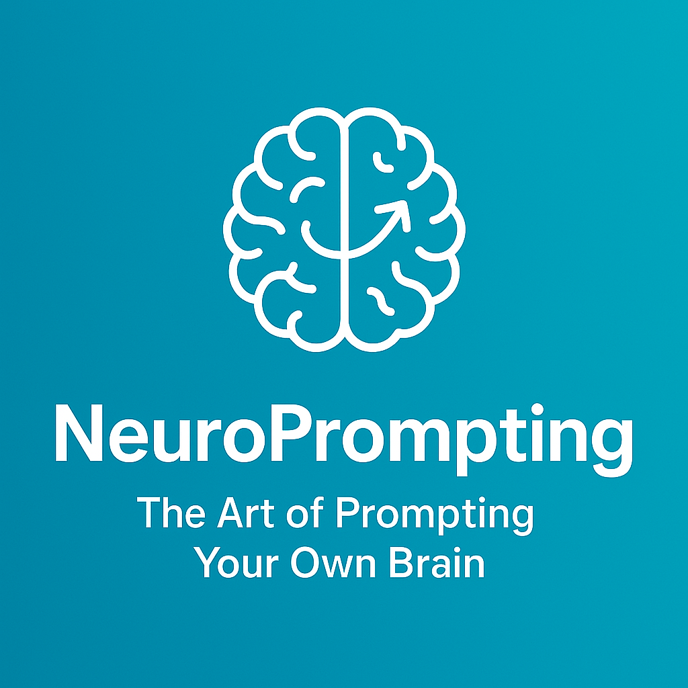

# 🧠 NeuroPrompting: A New Frontier in Prompt Engineering

**By Vishwa Hansnur**  
*Founder of NeuroPrompting*

---

## 🧠 Introduction

Have you ever found yourself writing a sentence, and as you reach the end of a line, you accidentally repeat the last word on the next line? Or when entering a 4-digit UPI PIN, you sometimes mistype the last digit as something personally meaningful, like your birth year?

These small, often unnoticed cognitive behaviors are more than just quirks—they're windows into how our mind processes patterns, memory, and intent.

This phenomenon inspired me to create and coin a new term: **NeuroPrompting**.

---

## 💡 What is NeuroPrompting?

**NeuroPrompting** is the practice of leveraging subconscious cognitive patterns, memory behavior, and intuitive responses to improve the way we construct prompts for generative AI systems.

> It’s where psychology meets prompt engineering.

While traditional prompt engineering focuses on crafting inputs that get accurate or creative responses from AI, **NeuroPrompting** digs deeper. It’s about understanding how your own brain behaves when asking questions or designing interactions with an AI.

---

## 🎯 Why It Matters

As AI gets more advanced, it doesn’t just respond to logic—it responds to nuance, context, and intent.  
If you understand how your mind influences your prompts, you can:

- Generate better outputs
- Build self-awareness
- Improve communication with AI tools
- Reflect your inner logic more clearly in queries

NeuroPrompting gives you a mirror to see how your brain thinks before the AI does.

---

## 🧩 Real-life Examples

- **Repeated Words**: When reaching the end of a sentence, your working memory might echo a word onto the next line. This shows how your brain chunked the thought.
- **UPI Mistyping**: Accidentally typing a meaningful number (like a birth year) instead of the correct one? Your brain is biased toward memorable associations.
- **Prompt Loops**: Ever repeat a question slightly differently to get better AI results? That's your cognitive system iterating subconsciously.

These are all reflections of **NeuroPrompting in action**.

---

## 🛠️ Applications

1. **Prompt Design**: Create prompts that match how users naturally think.
2. **Mental Health**: Track subconscious patterns in daily inputs.
3. **Education**: Help students learn how their minds interact with information.
4. **AI Training**: Build models that adapt to individual prompting styles.

---

## 🧾 Claiming the Concept

As of **April 2025**, I, **Vishwa Hansnur**, officially introduce **NeuroPrompting** to the world.  
This concept is new, unique, and unexplored in current academic or technical literature.

This GitHub repo and article act as the **first documented explanation** and **timestamp of its origin**.

---

## 🚀 What's Next?

- More articles and breakdowns on Medium
- A personal website for the NeuroPrompting concept
- Community collaboration and research invitations

---

## 📌 Final Thoughts

Every human is an algorithm in motion.  
**NeuroPrompting** is a way to study that algorithm—not with code, but with curiosity.

Thank you for reading.

---

